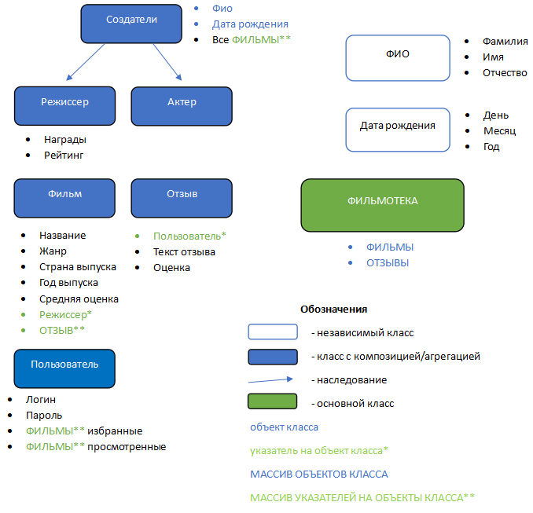

# Индивидуальный проект
## Выбранная предметная область: ФИЛЬМОТЕКА

## Цель работы:
Реализовать программное обеспечение для хранения информации о фильмах, поиска кино, добавления их в просмотренные и избранные.

## Задачи проекта:
1. Реализовать программное обеспечение для хранения фильмов.
2. Приложение должно обеспечивать возможность пользователю быстро и легко выполнять свои функции:
	- осуществлять поиск фильмов;
	- добавлять фильмы в избранные;
	- добавлять фильмы в просмотренные;
	- ставить оценку и оставлять отзыв.
3. Приложение должно обеспечивать возможность администратору быстро и легко выполнять свои функции:
	- добавлять новые фильмы;
	- добавлять/редактировать информацию о фильмах на платформе.
	
## Функциональные требования:
Приложение реализуется в виде windows-приложения с удобным навигационным меню, качественным отображением информации и простыми формами для заполнения и хранения данных.
Основные возможности, которые будут предусмотрены приложением:
1. Приложение реализуется с авторизацией по логину/паролю;
2. Основной режим работы приложения предоставляет пользователю возможность взаимодействовать с фильмами, представленными на платформе, но ограничивает доступ для добавления новых фильмов;
3. Доступ к особому режиму создания/изменения фильмов, добавления описания будет осуществляться по особому логину/паролю, которые будут выданы администратору;
4. Все данные будут храниться в csv-формате и подтягиваться при очередном запуске приложения. 

[Description of the study std::vector](/source/Description%20of%20the%20study%20Vector.pdf)

